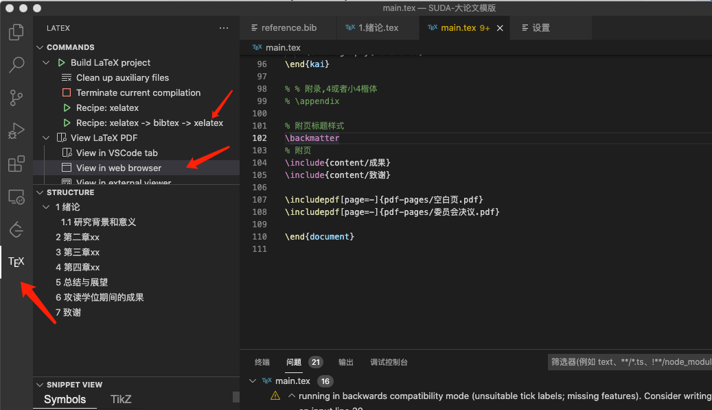

## 安装使用说明（在VScode中）
> overleaf在线编译器加载长篇论文太慢，所以选择与overleaf用法接近的vscode latex插件
>
> 借鉴了[yzhangcs](https://github.com/yzhangcs/master-thesis)师兄的大论文模版

### 1. 安装Latex编译环境

- windows用户安装： texlive
- mac用户安装：mactex


### 2. 安装vscode及其插件

- 下载VSCode

- 在VSCode插件市场中，安装**Latex workshop**和**Latex Language support**

- 在setting.json配置中添加：

  ```json
  "latex-workshop.latex.tools": [
          {
              "name": "xelatex",
              "command": "xelatex",
              "args": [
                  "-synctex=1",
                  "-interaction=nonstopmode",
                  "-file-line-error",
                  "-pdf",
                  "%DOC%"
              ]
          },
          {
              "name": "latexmk",
              "command": "latexmk",
              "args": [
                  "-synctex=1",
                  "-interaction=nonstopmode",
                  "-file-line-error",
                  "-pdf",
                  "%DOC%"
              ]
          },
          {
              "name": "pdflatex",
              "command": "pdflatex",
              "args": [
                  "-synctex=1",
                  "-interaction=nonstopmode",
                  "-file-line-error",
                  "%DOC%"
              ]
          },
          {
              "name": "bibtex",
              "command": "bibtex",
              "args": [
                  "%DOCFILE%"
              ]
          }
      ],
      "latex-workshop.latex.recipes": [
        	{
              "name": "xelatex -> bibtex -> xelatex",
              "tools": [
                  "xelatex",
                  "bibtex",
                  "xelatex"
              ]
          },
          {
              "name": "xelatex",
              "tools": [
                  "xelatex"
              ]
          }
      ]
  ```


### 3. 安装字体

> 仅mac用户需要， window用户好像不需要

以下7个字体安装包均在模版文件中，双击安装即可
- simhei.ttf
- simkai.ttf
- simsun.ttc
- stxingkai.ttf
- Tex-gyre-terms
  - texgyretermes-bold.otf
  - texgyretermes-bolditalic.otf
  - texgyretermes-italic.otf
  - texgyretermes-regular.otf


### 4. 导入项目及编译

- 使用vscode打开SUDA-Latex文件夹

- 使用 **Recipe: xelatex -> bibtex -> xelatex** 方式编译

- 编译成功后可以选择在vscode中或者浏览器中实时展示，都是实时编译

  


### 5. 项目主要结构

- main.tex # 入口tex

- reference.bib # 参考文献

- **content** # 主体章节内容（这个目录文件的名称必须英文）

  - cover.tex # 封面
  - abstract-zh.tex # 中文摘要
  - abstract-en.tex # 英文摘要
  - 1.introduction.tex # 绪论
  - 2.xxx #第二章
  - 3.xxx
  - 4.xxx
  - 5.conclusion.tex # 总结展望
  - achievement.tex # 个人成果
  - thanks.tex # 致谢

- **pdf-pages** # 直接插入的pdf页面，最后直接替换掉即可

  - 受权声明.pdf
  - 委员会决议.pdf
  - 独创性声明.pdf
  - 空白页.pdf

- simkai.ttf # 字体安装包 

- simsun.ttc # 字体安装包 

- stxingkai.ttf # 字体安装包

- **Tex-gyre-terms** # 字体安装包

  

*补充：以后有图和表，建议单独在根目录创建两个放图和表的文件夹*

### 6. 参考文献规范化后处理
> 因为有些从google学术等方式引用的参考文献仍为arxiv格式，并未更新到最新的会议格式，并且可能缺省了部分字段，
> 所以当论文最终完成后，需要统一规范化一下论文的参考文献格式。

 - 使用[rebiber](https://github.com/yuchenlin/rebiber)工具重新规范化自己的bib文件
 - 将新的reference.bib文件里的publisher直接全局替换为organization
